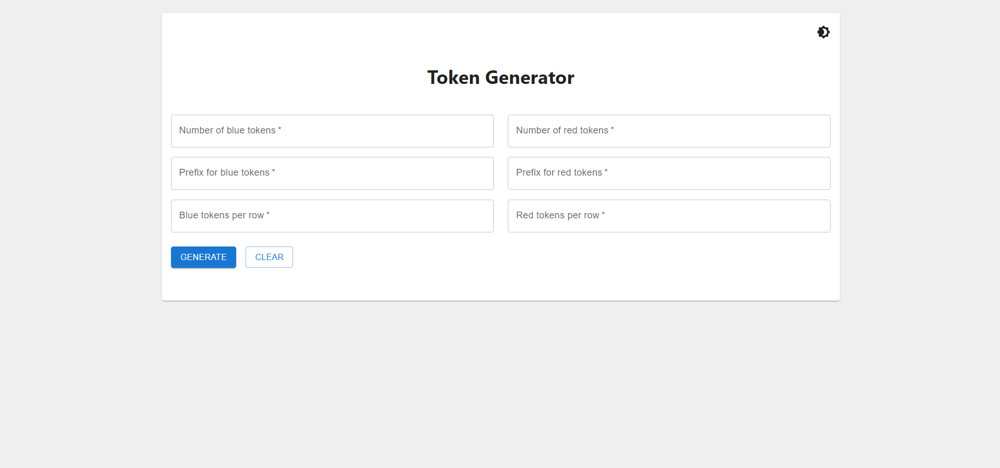
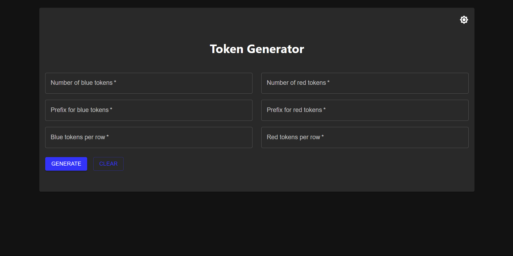

# Token Generator Application

A modern **Token Generator** application built with **React**, **Material UI**, and **Yup** for form validation. This app features an interactive and intuitive **dark mode UI**, ensuring a seamless user experience. The app allows users to generate secure tokens and offers a fully responsive and dynamic interface.

---

## Features

- **Token Generation**: Generate random tokens with customizable length.
- **Material UI**: Beautiful, responsive UI components for smooth user interaction.
- **Dark Mode**: Toggle between light and dark themes for optimal usability in different environments.
- **Form Validation**: Powered by **Yup** to ensure accurate and correct input before generating the token.
- **Mobile Responsive**:  Implemented with mobile responsive.
- **Interactive UI**: Smooth transitions, user-friendly controls, and error handling to guide users through the token generation process.

---

## Screenshots

### Light Mode

### Dark Mode



---

## Technologies Used

- **React**: A powerful JavaScript library for building user interfaces.
- **Material UI**: A popular React UI framework that provides pre-built components and design systems.
- **Yup**: A JavaScript schema builder for value parsing and validation.
- **React Hooks**: Used for managing state and effects in the application.
- **React Context API**: To manage and toggle dark mode across the application.

---

## Installation

### Prerequisites

Ensure that you have **Node.js** and **npm** (or **yarn**) installed on your local machine.

### Steps to Install

1. Clone the repository to your local machine:

   ```bash
   git clone https://github.com/yourusername/token-generator-app.git
   ```

2. Navigate to the project directory:

   ```bash
   cd token-generator-app
   ```

3. Install the dependencies:

   ```bash
   npm install
   # OR if you're using yarn
   yarn install
   ```

4. Start the development server:

   ```bash
   npm start
   # OR if you're using yarn
   yarn start
   ```

5. Open your browser and go to  ` to view the application in action!

---

## How It Works

### Token Generation

The user can enter a desired token length and click the **Generate Token** button. A random alphanumeric token is generated and displayed. The token can then be copied to the clipboard.

### Theme Toggle (Dark Mode)

The application supports both light and dark modes. You can switch between them by clicking the **Theme Toggle** button located in the app header.

### Form Validation

The token length is validated using **Yup** to ensure that users input a valid number within the acceptable range. Invalid inputs are flagged with an error message.

---

## Folder Structure

```
/token-generator-app
├── /public
│   ├── index.html
│   └── favicon.ico
├── /src
│   ├── /components
│   │   ├── ThemeToggle.jsx
│   │   ├── TokenDisplay.jsx
│   │   └── TokenGenerate.jsx
│   │   └── TokenInput.jsx
│   ├── /theme
│   │   └── theme.js 
│   ├── App.js
│   ├── App.css
│   ├── index.css
└── package.json
└── package-lock.json
```

- **/components**: Contains React components such as `TokenGenerator`, `Header`, and `ThemeToggle`.
- **/context**: Contains the `ThemeContext` for managing theme (dark/light mode).
- **/utils**: Utility functions like token generation logic.
- **theme.js**: Contains Material UI theme configuration for light and dark modes.

---

## How to Contribute

1. Fork the repository.
2. Create a new branch (`git checkout -b feature-name`).
3. Make your changes and commit them (`git commit -am 'Add new feature'`).
4. Push to your branch (`git push origin feature-name`).
5. Open a pull request.

---

## License

This project is licensed under the MIT License - see the [LICENSE](LICENSE) file for details.

---

## Acknowledgements

- **Material UI** for providing pre-designed components that make UI creation easy and elegant.
- **Yup** for simplifying form validation and error handling.
- **React** for building modern web applications with ease.

---

Feel free to reach out if you have any questions or suggestions!

---

Happy Coding! 🚀